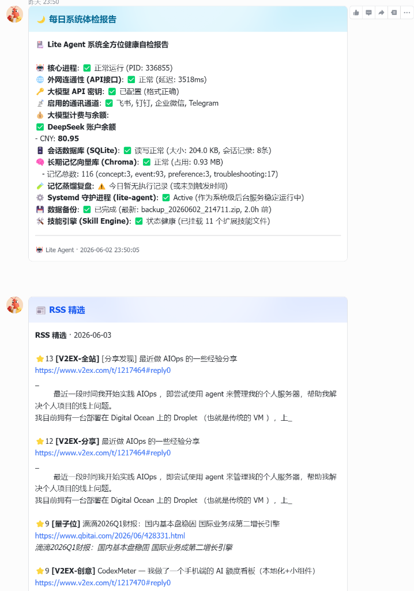

# Lite Agent

🚀 **Lite Agent** 是一个轻量级、零外部依赖（仅依赖官方 SDK）、支持深度思考大模型的私有化 AI 智能助手引擎。通过 WebSocket / HTTP 回调接入**飞书、钉钉、企业微信**三大国内 IM，并通过自然语言全自动调度本地服务器的运维、账单、RSS 精选等技能。


## 🌟 核心特性

- **多通道无缝接入**: 一套代码同时支持飞书 (WebSocket)、Telegram (Long Polling/Webhook)、钉钉、企业微信。
- **全自动多模态视觉 (OCR)**: 零额外指令！向机器人直接发送图片，自动调用外置大语言视觉模型（通过 `OCR_ENDPOINT` 代理），秒级解析并返回包含公式渲染的极致排版 Markdown。
- **动态技能引擎 (Skills)**: 通过简单的 Python 脚本即可为 Agent 扩展新能力（如发送邮件、查询数据）。
- **自带任务编排**: 支持将复杂任务拆解成多步 DAG 图执行。
- **自带定时任务 (Cron)**: 像配置 Crontab 一样轻松配置 Agent 主动推送。
- **自带长短期记忆 (Memory)**: 上下文不断片，随聊随记。
- **绝对轻量级**: 0 臃肿框架，纯原生 Python 实现，核心代码甚至可以写进一两个文件里。`/v1/chat/completions` 等 OpenAI 标准接口，支持 ChatBox、NextChat 等主流第三方客户端无缝对接。带有独立 Guest Token 机制，保障暴露在外网时的安全性。
- **多 Agent 编排复杂任务**: 遇到耗时复杂任务时，后台会自动将请求下发给 TaskOrchestrator，并多线程调度 Planner -> Worker -> Aggregator 的子任务流。
- **RSS 精选引擎**: 多源资讯聚合评分，V2EX 回复数权重加成，低质量标签降权，预计算缓存秒级推送。
- **外部独立监控**: crontab 定时检查 bot 存活，故障时通过企业微信告警，不依赖进程内 `/check`。

## 🛠️ 内置技能库

### 📰 RSS 资讯精选 (`ops_rss.py`)
- **多源聚合**: 量子位、机器之心、虎嗅、36氪、IT之家、V2EX 等，站点权重 + 关键词 + 回复数加权评分。
- **V2EX API 对接**: 调 V2EX API 获取回复数，热门帖自动加分，推广/交易帖自动降权。
- **预计算缓存**: 推送前 13 分钟预计算，HH:03 秒级读缓存发送。

### 💰 财务与账单管理 (`ops_billing.py`)
- **账单解析入库**: 自动从邮箱抓取信用卡账单并落库入账。
- **财务汇总报表**: 一键生成多维度月度/年度账单报表。
- **对账与提醒**: 支持临期还款检查、差异对账、大额交易筛查。

### 🖥️ 系统运维 (`ops_sys.py`, `ops_security.py`, `ops_logs.py`, `ops_self_check.py`)
- **健康自检**: `/check` 一键检查进程、网络、配置、DB、记忆、备份等 9 项指标。
- **安全审查**: 自动扫描 SSH 爆破尝试及异常登录。
- **日志分析**: 跨文件、多关键字高级日志检索。
- **数据备份**: 每天凌晨自动打包备份，`/check` 可查看备份状态。
- **证书监控**: SSL 证书有效期巡检，过期前推送告警。

### 📝 博客管理 (`ops_blog.py`)
- **自动发布与导出**: 结合 Halo API 实现全自动增量博客发布、批量文章导出备份。
- **无感交互**: 与大模型完美融合，只需自然语言即可完成博客素材重组、排版到发布的完整链路。

### ☁️ 云盘灾备 (`ops_bypy.py`)
- **百度网盘直连**: 原生集成 Bypy 客户端，支持网盘容量查询、远程目录管理。
- **自动化增量备份**: 配置深夜 Cron 定时任务，全自动将 Halo 博客数据及 Lite Agent 核心源码增量推送到百度网盘，实现狡兔三窟的数据保障。

### 🎵 媒体与NAS管理 (`ops_media.py`)
- **音乐库整理**: 对接 PostgreSQL 媒体数据库，支持按 FileHash 查重以及查询缺失封面的音乐。
- **全局安全规范**: 媒体库连接使用 `psycopg2` 直连，避免硬编码密码，完全遵守 `AI_GUIDELINES.md`。

## 📦 部署

### 1. 配置
项目采用 **环境变量分离** 的安全配置方案。

1. 复制 `.env.example` 为 `.env`，并在其中填入所有的敏感密钥（如 API Keys、数据库密码、各通道 Secret）：
```bash
cp .env.example .env
vim .env
```

2. 复制 `config.example.json` 为 `config.json`。该文件定义了非敏感的系统结构和定时任务，其中的 `${VAR}` 占位符会在运行时自动从 `.env` 中读取替换：
```bash
cp config.example.json config.json
```

### 2. 启动
```bash
pip install -r requirements.txt
python3 main.py
```

## 💬 交互指令

| 指令 | 说明 |
|------|------|
| `::rss [ai\|v2ex]` | 查看 RSS 资讯列表 |
| `::rss push` | 手动推送精选简报 |
| `::rss log` | 查看推送/预计算日志 |
| `/check` | 全方位健康自检（进程/网络/备份/DB 等 9 项） |
| `/cron` | 查看定时任务列表 |
| `/cron <序号>` | 手动执行某个定时任务 |
| `/cron log` | 查看定时任务执行日志 |
| `/remember <type> <内容>` | 强制记录长期记忆 |
| `/memory` | 查看记忆池状态 |
| `/balance` | 查询 API 余额 |
| `/status` | 查看会话状态与 Token 消耗 |
| `/history` | 最近对话历史 |
| `/new` | 重置会话 |
| `/help` | 完整帮助 |

## 📄 开源协议

[MIT License](LICENSE)
